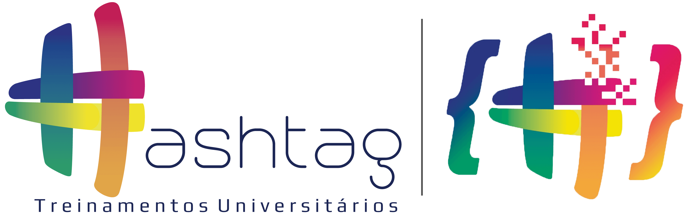

<h1 align="center">
    <strong>Intensivão de Python - <a href="https://www.hashtagtreinamentos.com/curso-python/" target= "_blank" rel="noreferrer noopener">Hashtag Programação</a> #️⃣🐍</strong>
</h1>

<h1 align="center">
    
</h1>

O **Intensivão de [Python][python]** é um evento 100% online e gratuito com duração de 4 dias, organizado pela **[Hashtag Treinamentos](https://www.hashtagtreinamentos.com/)**.

## 💻 Sobre

Nesse evento são disponibilizados diversos conteúdos de Python com o objetivo de ajudar os participantes a destacar em qualquer empresa no Mercado de Trabalho.

Durante o Intensivão é desenvolvido projetos reais e completos em Python, partindo do absoluto zero.

Os assuntos abordados são: Projetos de Automação de Processos, Análise de Dados, Ciência de Dados e Inteligência Artificial, Automação Web (Web-scraping), entre outros.

## 📅 Conteúdo

✔️ **[Aula 1][aula-1]** - Automação de Processos e Tarefas com Python 
✔️ **[Aula 2][aula-2]** - Análise de Dados com Python 
🚧 **[Aula 3][aula-3]** - Projeto Completo de Data Science + Machine Learning 
🚧 **[Aula 4][aula-4]** - Automação Web (Web-Scraping) com Python 

<!-- | STATUS | AULA | DATA  | ASSUNTO                                              |
|:------:|:----:|:-----:|:-----------------------------------------------------|
| ✔️    | 1    | 08/02 | [Automação de Processos e Tarefas com Python][aula-1] |
| ✔️    | 2    | 09/02 | Análise de Dados com Python                          |
| 🚧    | 3    | 10/02 | Projeto Completo de Data Science + Machine Learning  |
| 🚧    | 4    | 11/02 | Automação Web (Web-Scraping) com Python              | -->

## 💡 Motivação

Repositório criado para estudos do Intensivão de Python, bem como registro das atividades desenvolvidas.

## 📃 Licença

O repositório está sob a licença [MIT][mit]. Consulte o arquivo [LICENSE](https://github.com/bryan-lima/intensivaopython-hashtagprogramacao/blob/master/LICENSE) para obter mais detalhes.

[aula-1]: https://github.com/bryan-lima/intensivaopython-hashtagprogramacao/tree/master/aula-1
[aula-2]: https://github.com/bryan-lima/intensivaopython-hashtagprogramacao/tree/master/aula-2
[aula-3]: https://github.com/bryan-lima/intensivaopython-hashtagprogramacao/tree/master/aula-3
[aula-4]: https://github.com/bryan-lima/intensivaopython-hashtagprogramacao/tree/master/aula-4
[python]: https://www.python.org/
[mit]: https://opensource.org/licenses/MIT
